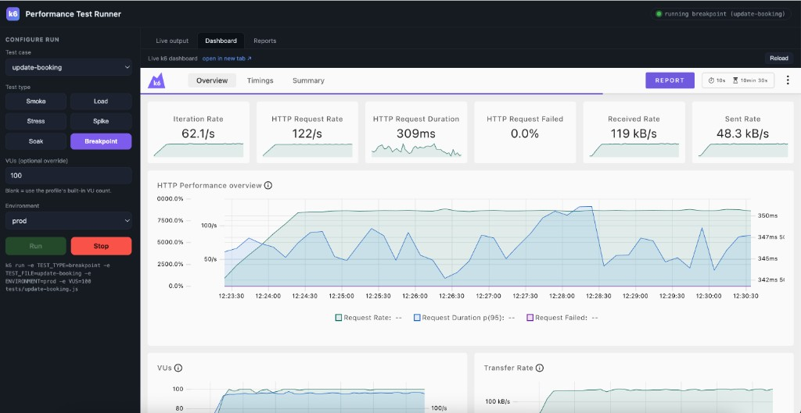
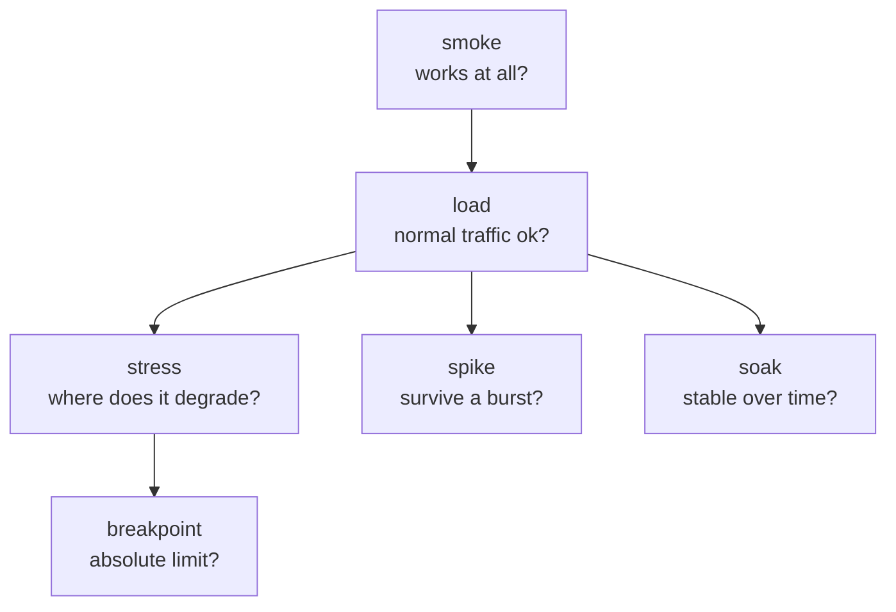
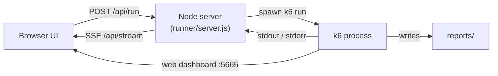

# k6 Performance Testing Suite

A **maintainable, scalable performance-testing suite** built with [Grafana k6](https://k6.io/),
targeting the public [Restful-Booker](https://restful-booker.herokuapp.com/apidoc/index.html) API.

Any test case can run as a **smoke, load, stress, spike, soak, or breakpoint**
test just by switching one environment variable - no duplicated code. It runs
from the CLI, from a **web UI**, and in **GitHub Actions**, and every run produces
rich **HTML + JUnit + JSON** reports.



---

## Why this suite matters

Performance issues are expensive when found in production. This suite lets a team
answer critical questions *before* users do:

| Question | How this suite answers it |
| --- | --- |
| Does the app meet its speed SLAs? | Shared **thresholds** (p95/p99 latency, error rate) fail the run if breached |
| How much traffic can it handle? | **Stress** and **breakpoint** tests find the ceiling / breaking point |
| Does it survive traffic spikes? | **Spike** test simulates sudden bursts |
| Are there memory leaks / slow degradation? | **Soak** test runs sustained load over time |
| Did this change slow things down? | **Smoke/load** tests run automatically on every PR |
| Which endpoint is the bottleneck? | Per-operation test cases isolate each API call's latency |

**Impact:** catch regressions in CI, size infrastructure with real numbers,
validate SLAs, and turn "it feels slow" into measurable, repeatable evidence.

---

## Key features

- **Decoupled design** - `test case x test type` = every combination, zero duplication
- **6 load profiles** - smoke, load, stress, spike, soak, breakpoint
- **7 test cases** - full CRUD coverage of the Restful-Booker API
- **Custom VU override** - run any profile at a specific VU count (`VUS=100`)
- **Rich reports** - HTML, JUnit, and JSON generated per run
- **Live dashboard** - k6's real-time web dashboard, plus a full **web test runner UI**
- **CI-ready** - GitHub Actions with a PR smoke matrix, manual dispatch, and nightly soak
- **No heavy dependencies** - pure k6; the runner UI is a dependency-free Node server

---

## Prerequisites

- **[k6](https://grafana.com/docs/k6/latest/set-up/install-k6/)** - `brew install k6`, `choco install k6`, or the official packages
- **Node.js** (only for the optional web runner UI) - any recent LTS
- No `npm install` needed: external report libraries are fetched by k6 at runtime

---

## Quick start

```bash
# 1. Smoke-test the full booking journey (fast sanity check)
make smoke

# 2. Or launch the web UI and click Run
make ui        # then open http://127.0.0.1:8080
```

---

## Test types (load profiles)

The **test type** decides *how much* traffic to generate. Defined once in
[scenarios/profiles.js](scenarios/profiles.js) and reused by every test case.

| Type | Purpose | What it tells you | Load shape |
| --- | --- | --- | --- |
| **smoke** | Sanity check | "Does the test + API even work?" | 1 VU, 30s |
| **load** | Average expected traffic | "Is normal traffic within SLA?" | ramp to ~50 VUs |
| **stress** | Beyond normal traffic | "Where does performance start to degrade?" | ramp to ~300 VUs |
| **spike** | Sudden burst | "Can it absorb a traffic surge and recover?" | jump to 300 VUs, then drop |
| **soak** | Sustained endurance | "Any leaks or slow degradation over time?" | 30 VUs, long duration |
| **breakpoint** | Ramp until failure | "What is the absolute breaking point?" | rising rate until thresholds abort |



Long profiles can be shortened for CI, e.g. `-e SOAK_DURATION=10m`.

---

## Test cases

The **test case** decides *what* to exercise. Each file in `tests/` is
self-contained; booking operations share reusable helpers in
[lib/booking.js](lib/booking.js) so every call is measured consistently.

| Test file | API operation(s) | Endpoint | Auth |
| --- | --- | --- | --- |
| `create-booking` | CreateBooking | `POST /booking` | no |
| `update-booking` | UpdateBooking (full replace) | `PUT /booking/:id` | yes |
| `partial-update-booking` | PartialUpdateBooking | `PATCH /booking/:id` | yes |
| `delete-booking` | DeleteBooking | `DELETE /booking/:id` | yes |
| `booking-read` | GetBookingIds + GetBooking | `GET /booking`, `GET /booking/:id` | no |
| `booking-flow` | Full journey: create -> read -> update -> patch -> delete | all of the above | yes |
| `health` | HealthCheck | `GET /ping` | no |

---

## Running tests

Everything is driven by two variables: **`TEST_TYPE`** (the profile) and
**`TEST_FILE`** (the test case). Pick your favorite way to run.

### Makefile (simplest)

```bash
make smoke|load|stress|spike|soak|breakpoint [TEST=<file>] [VUS=<n>]

make load TEST=create-booking          # load-test the create endpoint
make stress TEST=partial-update-booking VUS=100
make read                              # read-heavy test (load profile)
make health                            # /ping check
make help                              # list every target
```

### Raw k6 (full control)

```bash
k6 run -e TEST_TYPE=spike -e TEST_FILE=booking-flow tests/booking-flow.js
```

### npm scripts

```bash
npm run smoke      # load / stress / spike / soak / breakpoint also available
```

### Overriding the VU count

Run any profile at a custom peak VU count with `-e VUS=<n>` (or `VUS=<n>` on a
`make` target). The profile's **shape is preserved**:

- ramping profiles (load/stress/spike) scale proportionally so their peak = `VUS`
- constant profiles (smoke/soak) run exactly `VUS` VUs
- breakpoint (rate-based) caps its VU pool

```bash
make stress VUS=100                    # stress ramp peaking at 100 VUs
k6 run -e TEST_TYPE=soak -e VUS=25 -e SOAK_DURATION=10m -e TEST_FILE=booking-flow tests/booking-flow.js
```

---

## Web test runner UI

Prefer clicking over typing? Launch the built-in runner:

```bash
make ui        # or: npm run ui  ->  http://127.0.0.1:8080
```

From the UI you can:

- **Configure** a run - pick a test case (auto-detected from `tests/`), test
  type, optional VUs, and environment; a live preview shows the exact `k6 run` command
- **Run / Stop** and watch the status pill (idle / running / finished / error)
- **Live output** tab - k6 console output streams in real time
- **Dashboard** tab - k6's real-time charts embedded in the page (shown above)
- **Reports** tab - open any generated HTML/JUnit/JSON report



It's a dependency-free Node server ([runner/server.js](runner/server.js)) that
shells out to k6, so it runs the exact same tests as the CLI. Ports are
configurable via `UI_PORT` / `DASH_PORT`.

> The runner needs a long-running host with k6 installed - run it locally or on a
> VM/container, **not** on serverless platforms like Vercel.

---

## Live dashboard (no UI server)

k6 has a built-in real-time dashboard you can use on its own:

```bash
make dash TYPE=load TEST=booking-flow      # live charts at http://127.0.0.1:5665
```

It shows live request rate, response-time percentiles, VUs, checks, and errors,
and exports `reports/<file>-<type>-dashboard.html` when it finishes.

---

## Reports

Every run writes to `reports/` via [lib/report.js](lib/report.js):

- `<file>-<type>-summary.html` - rich, shareable HTML report
- `<file>-<type>-junit.xml` - JUnit, for CI test reporting
- `<file>-<type>-summary.json` - raw metrics for custom processing
- a text summary is also printed to the console

```bash
open reports/booking-flow-load-summary.html   # macOS
```

File names embed the test case + type so parallel runs never overwrite each other.

---

## Thresholds (SLAs)

Pass/fail criteria live in [config/thresholds.js](config/thresholds.js):

- `http_req_duration` - p95 < 2s, p99 < 4s
- `http_req_failed` - error rate < 5%
- `checks` - > 95% passing
- `business_errors` - custom app-level error rate < 5%

If a threshold is breached, **k6 exits non-zero and the CI job fails**. The
`breakpoint` profile adds `abortOnFail` thresholds so it stops ramping the moment
the API clearly degrades.

---

## Environments & credentials

All hosts and credentials live in [config/environments.js](config/environments.js)
and are driven by environment variables (nothing sensitive is hardcoded).

| Variable | Default | Purpose |
| --- | --- | --- |
| `ENVIRONMENT` | `prod` | Which environment block to use (`prod`/`staging`/`local`) |
| `API_USERNAME` | `admin` | Auth username (`POST /auth`) |
| `API_PASSWORD` | `password123` | Auth password |
| `TEST_TYPE` | `smoke` | Load profile |
| `TEST_FILE` | `test` | Test name for report file naming |
| `VUS` | _(profile default)_ | Override peak VU count |
| `SOAK_DURATION` | `30m` | Duration of the `soak` profile |

The defaults are Restful-Booker's public demo login. Override per run:

```bash
k6 run -e API_USERNAME=me -e API_PASSWORD='secret' -e TEST_TYPE=smoke -e TEST_FILE=booking-flow tests/booking-flow.js
```

> Never commit real credentials. In CI, store them as GitHub Actions secrets.

---

## Project structure

```
config/       environments (base URLs, creds) + shared SLA thresholds
scenarios/    load profiles (one per test type) - the "how much traffic"
lib/          building blocks: http wrapper, auth, booking ops, metrics, report
data/         payload factories (test data)
tests/        thin test cases - the "what to test"
runner/       local web UI to launch tests + watch the live dashboard
docs/         screenshots / assets
reports/      generated artifacts (gitignored)
.github/      CI workflow
```

**The core idea:** a *test case* describes **what** to exercise; a *profile*
describes **how hard**. Combine them freely with two env vars.

---

## Continuous integration

[.github/workflows/k6.yml](.github/workflows/k6.yml) provides:

- **Push / PR** - a fast **smoke matrix** across all test cases, so regressions surface immediately
- **Manual dispatch** - pick any `test_file` + `test_type` + `environment` + `vus` from the Actions UI
- **Nightly schedule** - a short soak run

All jobs upload the `reports/` folder as build artifacts.

---

## Adding a new test case

1. Create `tests/my-test.js`.
2. Reuse the shared wiring:

```js
import { getProfile } from '../scenarios/profiles.js';
import { thresholds } from '../config/thresholds.js';
import { get } from '../lib/http.js';

const profile = getProfile(__ENV.TEST_TYPE || 'smoke');
export const options = { ...profile, thresholds: { ...thresholds, ...(profile.thresholds || {}) } };
export { handleSummary } from '../lib/report.js';

export default function () {
  get('myOp', '/some/path', { expectedStatus: 200 });
}
```

That's it - the new case instantly supports all six load profiles, the VU
override, full reporting, the web UI, and CI.

---

## Notes

- Restful-Booker is a free demo host that can be slow or cold-start; thresholds
  are set to realistic values and CI smoke runs are kept light to avoid flakiness.
- Soak/breakpoint default to long durations locally; shorten them in CI with
  `SOAK_DURATION` and the workflow's built-in overrides.
